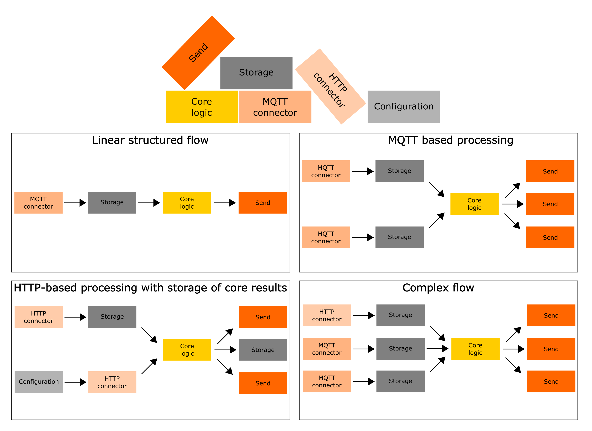

Lightweight Python library for configuring ETL (Extract, Transform, Load) pipelines. 
Designed to create services with multi-step data processing using just Python and nothing more.

## Why you should try wiredflow

This module is a simplified analogue of ETL-related libraries (e.g. 
[luigi](https://github.com/spotify/luigi) and [petl](https://github.com/petl-developers/petl)) and 
workflow management (workflow orchestration) platforms (e.g. [Apache Airflow](https://github.com/apache/airflow)
and [prefect](https://github.com/PrefectHQ/prefect)). 

This module is well-suited for both prototype preparation, quick experiments, 
and incorporation into industrial systems step-by-step. However, we recommend 
starting to use the library as a tool for prototyping. It could be especially 
convenient for IoT applications data processing (data from sensors often can 
be delivered via MQTT protocol). So wiredflow is pretty good solution for continuous streaming workflows.
It allows configuring HTTP/HTTPS, MQTT, database connectors, schedulers, and much more to use all of it through 
pure Python.

Below is a Q&A section to make it clearer 
to you how this library differs from other more well-known analogues.

> **Question**: What does "lightweight" mean?
> 
> **Response**: That means that the library only uses native Python to run. 
> Thus for basic usage there is no need to install **docker** or deal with **docker-compose**, you do 
> not need to deploy the **database** locally (or non-locally) or figuring out how perform desired actions 
> on **AWS** with full production infrastructure - you can just use your laptop and run 
> the python script as "hello_world.py". The only thing you need to know to work 
> with wiredflow is Python.

---

> **Question**: What is the advantage of such a lightweight?
> 
> **Response**: 1) Prototyping - you can quickly start listening to your MQTT 
> queues or start collecting data using HTTP requests, etc. 2) Python code 
> would be easy to build into larger projects because using wiredflow has 
> pretty low overhead.

---

> **Question**: If wiredflow does not use a database, where is the data saved?
> 
> **Response**: In csv files or in JSON files. Yes, this is not a production solution, 
> but it is very convenient to deal with data you unfamiliar with.

---

> **Question**: What if I want to use the database?
> 
> **Response**: Sure you can use a database, for example you can use a local one 
> or save (and retrieve) the data to the already configured remote one.

---

> **Question**: Can I create Python scripts that will combine data from multiple 
> sources (APIs) and store data in a storage?
>
> **Response**: Sure! That's exactly what wiredflow is for.

---

> **Question**: I saw in the documentation that the service can be subscribed to 
> multiple MQTT queues at the same time. How does it work?
> 
> **Response**: wiredflow uses the multithreading Python module. 

---

## Installation
Use the following command to install this module

```
pip install git+https://github.com/wiredhut/wiredflow.git
```

## Usage examples

NB: All examples should start in your virtual environment without any problems. 
The wiredflow-based services do not require any configuration beyond Python and
library's dependencies (unless it is explicitly stated).

First, check [examples](examples) folder, which can be easily launched locally: 
* [simple HTTP case](examples/simple_http.py) - single data source which can be reached via simple HTTP GET request
* [simple HTTP case with configuration](examples/simple_http_with_configuration.py) - single data source which can be reached via simple HTTP POST request.
  Parameters of POST request configured with custom logic.
* [advanced HTTP case](examples/advanced_http.py) - several data sources (receive data via HTTP) with custom data processing
* [simple MQTT case](examples/simple_mqtt.py) - single data source which send messages using MQTT
* [advanced MQTT case](examples/advanced_mqtt.py) - several data sources (receive data via MQTT) with custom data processing
* [complex multi-source case](examples/complex_flow.py) - complex flow example with custom multi-step data processing and several notificators

Examples with pre-configured databases:
* [simple_http_with_mongo.py](examples/simple_http_with_mongo.py) - single data source which can be reached via simple HTTP GET request and
saved into MongoDB. Tutorial how to configure free remote MongoDB can be [found here](https://www.mongodb.com/basics/mongodb-atlas-tutorial).

Or investigate jupyter notebooks with examples: 
* In progress

## Description

The library is not a low-code solution, but it's great for developing custom pipelines when you can't avoid writing custom business logic. 
The library consists of the following key blocks (by combining these blocks it is possible to implement processing pipelines of flexible structure): 
* **Configuration** - Optional block before HTTP and MQTT (or another) connectors to configure connector parameters. Allows implementing custom configurations
  logic using Python function. Configuration block pass parameters to next stage.
* **HTTP connector** - Retrieving data using `HTTP` requests, for example using the `GET` method.
* **MQTT connector** - Retrieving data using `MQTT` protocol, the connector subscribes to the MQTT queue and receives data real-time.
* **Storage** - File or database where to save data
* **Core logic** - An abstraction that allows implementing custom business logic using Python function. Core logic block pass data to next stage.
* **Send** - An abstraction that sends data received through core logic processing to specified endpoints. 
  Can use both `MQTT` brokers and standard `POST`/`PUT` `HTTP`/`HTTPS` methods 

To make it clearer, here are some examples of possible service structures that can be built using wiredflow:



The fastest way to understand wiredflow is to think of it as a lightweight builder for services. 
Protocols, endpoints, notifications, schedulers and storages are our constructor, and we (engineers), can play with it the way we want to.

### Wiredflow is your friend

When you start using **wiredflow** to solve real tasks, you may find that some of the flows structures are difficult to implement
using native functionality. For example, to assign several data sources to a core logic block without using intermediate storages. 


When this happens, keep in mind: "Wiredflow is your friend". Implementation through storages is almost always more reliable
and robust even if you use as storages local files. Thus, Wiredflow encourages you to use more robust solutions in designing services.

However, if you are sure about what you are doing, you can always implement custom blocks and work around this limitation.
Because Wiredflow is your friend, and real friends won't force you to do something ypu don't want to.


### Documentation 
The full documentation build for this library can be found [here]().
however, there are some main aspects shown below:

### Available connectors (per protocols)

| Connector |   Command for adding    | Short description                                                          |
|-----------|-------------------------|----------------------------------------------------------------------------|
| MQTT      | `with_mqtt_connector()` | Create stage with ability to subscribe to MQTT topic and recieve data      |
| HTTP      | `with_http_connector()` | Create stage with ability to send GET requests using HTTP / HTTPS protocol |

### Available storages (databases and files storages for local usage)

|  Storage  |      Command for adding           | Short description                                             |
|-----------|-----------------------------------|---------------------------------------------------------------|
| JSON file | `with_storage('json', **params)`  | Create and use local JSON file and use it as data storage     |
| CSV file  | `with_storage('csv', **params)`   | Create and use local CSV file and use it as data storage      |
| MongoDB   | `with_storage('mongo', **params)` | Define connect to already initialized MongoDB instance        |

### Available senders

|  Sender       |      Command for adding       | Short description                                        |
|---------------|-------------------------------|----------------------------------------------------------|
| MQTT broker   | `send('mqtt', **params)`      | Send defined data aggregate using MQTT protocol          |
| POST request  | `send('http_post', **params)` | Send defined data aggregate using HTTP POST method       |
| PUT request   | `send('http_put', **params)`  | Send defined data aggregate using HTTP PUT method        |


## Contributing 
In progress

Check [contribution guide](docs/contributing.md) for more details. 

